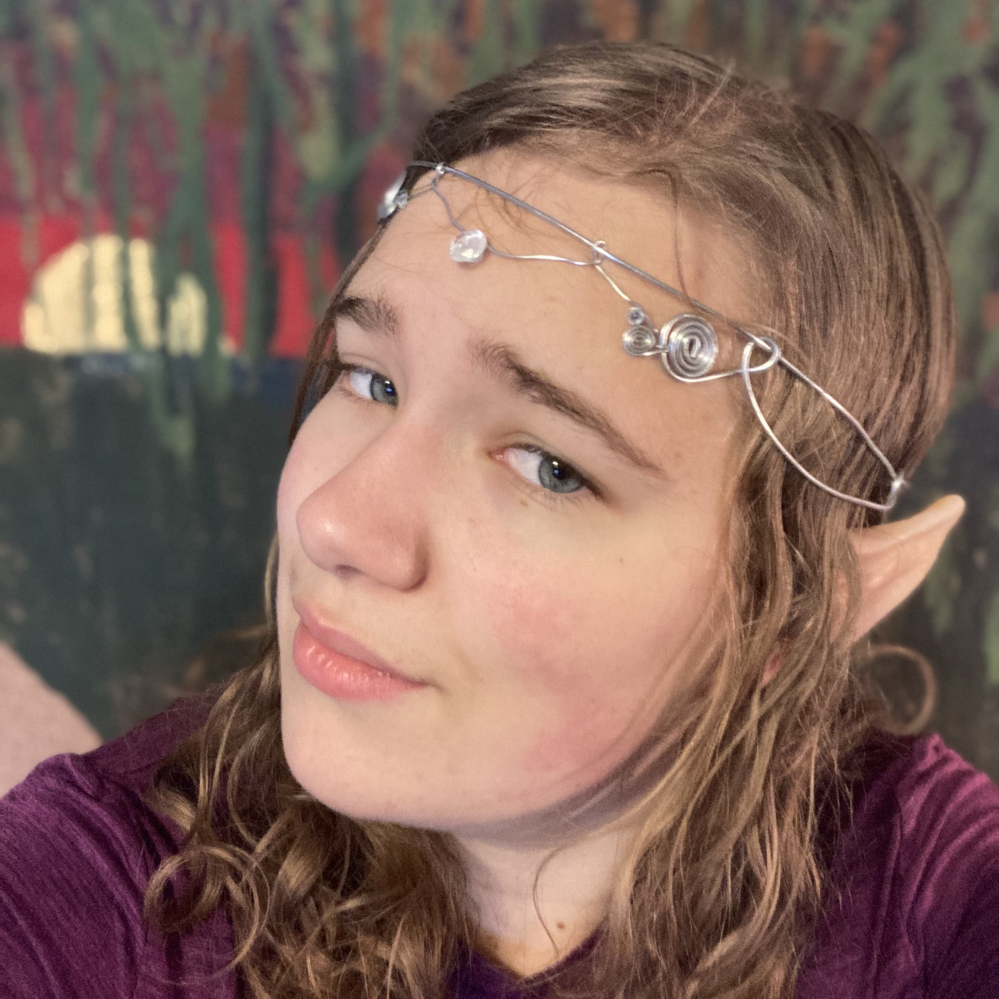

#Subspace 620
###U of A Science Fiction and Fantasy Club

##Current Crew

> #### President
> [Lt. Ana Jones](crew/AnaJones.html)
> 

> #### Vice President
> [Commander Sean Moran](crew/SeanMoran.html)
> 

> #### Secretary/Treasurer
> [Lt. Destiny Ducommun](crew/Destiny.html)
> 

> ## Extended Exec
> [Lt. Joshua Mayer](crew/JoshuaMayer.html)
> 

> #### Extended Exec
> [Lt. Colleen Lamb](crew/Colleen.html)
> 

### What do the rankings mean?

The ranks are defined in the Subspace 620's constitution. In short form, they are:

- Fleet Admiral: former president with high honours for exceptional commitment to the club
- Admiral: former president
- Vice-Admiral: former member with honours for great commitment to the club
- Captain: current president
- Commander: current vice-president
- Lieutenant  Commander: current secretary/treasurer
- Lieutenant: current extended executive
- Lieutenant  Junior: any member who has been in the club for more that a year
- Ensign: any new member